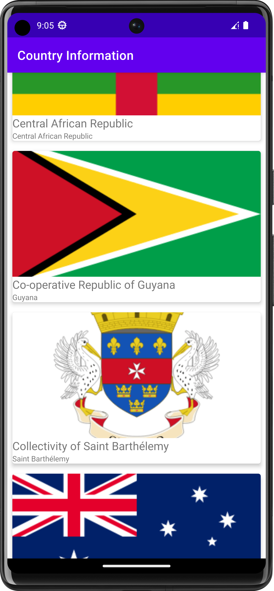
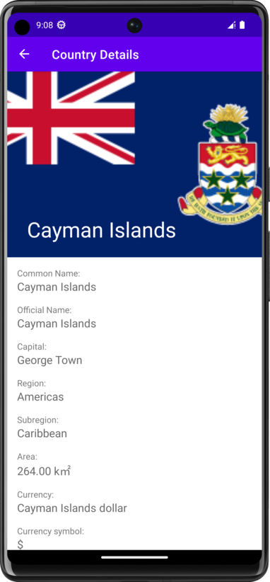
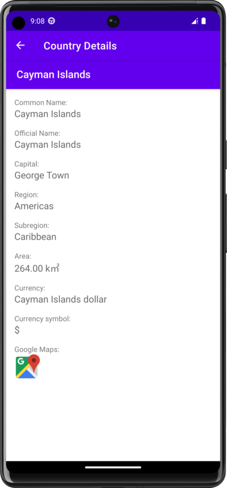
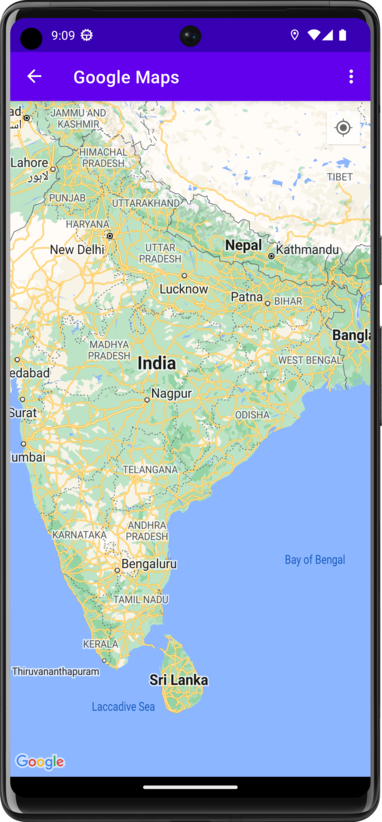

# Country Information

[](https://android-arsenal.com/api?level=24)

Application designed for Udacity nanodegree program - Kotlin Developer.

## External API

I'm using external API to fetch countries informations.
https://restcountries.com/
Get information about countries via a RESTful API

check out their Gitlab repo:
https://gitlab.com/restcountries/restcountries


## Features ✨

- Android Materials
- Navigation
- Retrofit 2
- Moshi
- Coroutines
- Room
- Glide
- Shimmer
- Google Maps API

## Project Milestones

### Android UI/UX
- Build a navigable interface consisting of multiple screens of functionality and data
- Construct interfaces that adhere to Android standards and display appropriately on screens of different size and resolution
- Animate UI components to better utilize screen real estate and create engaging content

### Local and Network data
- Connect to and consume data from a remote data source such as a RESTful API
- Load network resources, such as Bitmap Images, dynamically and on-demand
- Store data locally on the device for use between application sessions and/or offline use

### Android system and hardware integration
- Architect application functionality using MVVM
- Implement logic to handle and respond to hardware and system events that impact the Android Lifecycle
- Utilize system hardware to provide the user with advanced functionality and features

## Installation

Please add your Google Maps API KEY to the local.properties

```sh
# Google Maps API key
MAPS_API_KEY=<YOUR_API_KEY>
```

## Overview


|   |  |
|----------------------------------------| ------ |
|   |  |
|----------------------------------------| ------ |